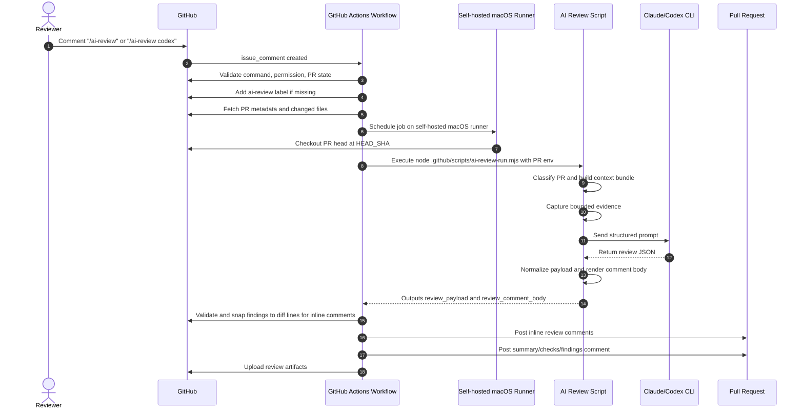
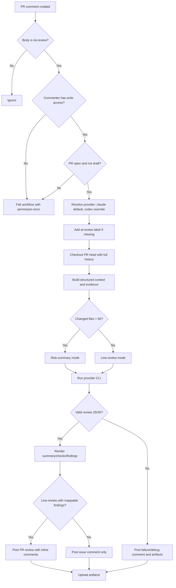

# AI Review Flow

This document defines the end-to-end flow for the first-level AI review on Arca PRs.

The implementation lives in:
- `.github/workflows/ai-review.yml` — GitHub Actions control plane
- `.github/scripts/ai-review-run.mjs` — Node entrypoint executed by the workflow
- `.github/scripts/ai-review-run.sh` — canonical review implementation invoked by the MJS wrapper
- `.github/ai-review/config.yml` — repository-specific reviewer guidance

The workflow and runner pair are synchronized from `houseworksinc/skills/github-ai-review-workflow`. Do not modify their copies locally; add repository-specific reviewer guidance only in `.github/ai-review/config.yml`.

Optional provider model pins:
- `AI_REVIEW_CLAUDE_MODEL` — passed only to Claude runs
- `AI_REVIEW_CODEX_MODEL` — passed only to Codex runs
- `AI_REVIEW_MODEL` — legacy fallback used only when the provider-specific variable is unset

## Trigger

A reviewer with write access comments on an open, non-draft PR:

```text
/ai-review
```

Claude is the default provider. Codex can be selected manually:

```text
/ai-review codex
```

The workflow adds the `ai-review` label the first time it is invoked.

## End-To-End Flow

1. GitHub receives an `issue_comment` event on a PR.
2. The workflow validates the command, commenter permission, PR state, and provider.
3. The workflow adds the `ai-review` label if missing.
4. The workflow collects PR metadata, changed files, base SHA, and head SHA.
5. The self-hosted macOS runner checks out the PR head with full history.
6. The checked-in MJS wrapper invokes the checked-in shell runner, which builds structured context:
   - PR classification: `dependency`, `backend`, `frontend`, `workflow`, `docs`, or `mixed`
   - grouped changed files
   - diff stat and bounded unified diff
   - changed hunks with nearby code
   - touched and related tests
   - dependency metadata when manifests or lockfiles changed
7. The runner captures bounded evidence in `evidence.md`.
8. The selected CLI provider runs against the structured prompt.
9. The runner normalizes the provider response into JSON:
   - `summary[]`
   - `checks[]`
   - `findings[]`
   - `handoff_notes[]`
10. The workflow posts line-specific findings as PR review comments, snapping them to the nearest line in the same file's diff when needed.
11. The workflow posts the summary, checks, non-line-specific findings, and runner metadata as the main PR comment.
12. The workflow uploads review artifacts for debugging.

## Sequence Diagram



## Control Flow



## Artifacts

Each run uploads:
- `prompt.txt`
- `context-bundle.md`
- `evidence.md`
- `review-payload.json`
- `review-comment.md`
- `raw-output.txt`
- `codex-events.jsonl` when Codex runs
- `metadata.txt`

## Porting Checklist

Use this when copying the workflow into another repo:

1. Copy `.github/workflows/ai-review.yml`, `.github/scripts/ai-review-run.mjs`, and `.github/scripts/ai-review-run.sh` from `houseworksinc/skills`.
2. Add repository-specific reviewer guidance only in `.github/ai-review/config.yml`.
3. Set optional model pins only if needed:
   - `AI_REVIEW_CLAUDE_MODEL`
   - `AI_REVIEW_CODEX_MODEL`
4. Confirm the runner has the required CLIs installed and authenticated.
5. Ensure the target repo uses the same branch-protection posture for `main` or adjust the workflow trigger and PR assumptions.
6. Verify the `ai-review` label exists, or let the workflow create it on first run.
7. Run one dependency PR, one backend PR, and one docs-only PR before treating the port as stable.
8. Remove or rewrite `Later` items that are specific to `arca-api` before reusing the doc in the next repo.

## Remaining Work

Track AI review follow-up work here until this grows large enough to need a separate project tracker.

| Status | Item | Notes |
|---|---|---|
| Done | Comment trigger | `/ai-review` and `/ai-review codex` trigger the workflow. |
| Done | Provider switch | Claude is default; Codex is manual override. |
| Done | Repo-local execution | Workflow calls the checked-in MJS wrapper, which invokes the checked-in shell runner. |
| Done | Inline comments | Valid changed-line findings are posted with PR review comments. |
| Done | Structured context | Runner builds classification, grouped files, hunks, related tests, and dependency metadata. |
| Done | Evidence artifact | Runner writes bounded check output to `evidence.md`. |
| Done | Node 24 action cleanup | AI Review uses `actions/github-script@v9`, `actions/checkout@v6`, and `actions/upload-artifact@v7`. |
| Done | Provider-specific model variables | `AI_REVIEW_CLAUDE_MODEL` and `AI_REVIEW_CODEX_MODEL` avoid passing one incompatible model id to both CLIs. |
| Next | Live validation | Run the current script version against dependency, backend, and docs-only PRs after merge. |
| Done | Artifact validation | Current script smoke-test writes `prompt.txt`, `context-bundle.md`, `evidence.md`, `review-payload.json`, `review-comment.md`, `raw-output.txt`, `metadata.txt`, and `codex-events.jsonl` only for Codex runs. |
| Next | Tune prompt from real output | Adjust schema/rules based on false positives, missed issues, and formatting drift. |
| Later | Arca Web rollout | Reuse the runner script for `arca-web` after one stable `arca-api` cycle. |
| Later | Product-brain retrieval | Add targeted cross-repo context once the Mac mini layout is final. |
| Later | Queue metrics | Track run count, duration, provider, classification, findings, and failure reasons. |
